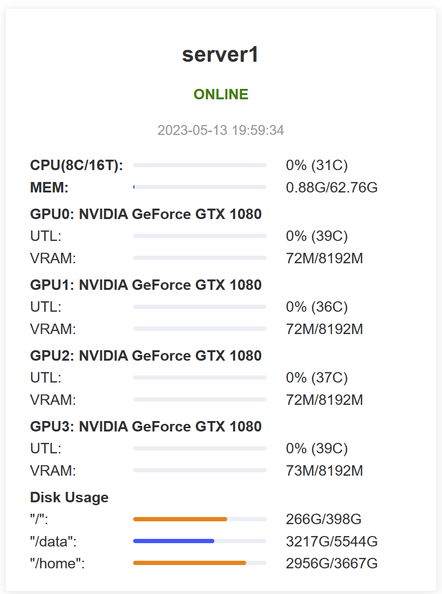

# server-monitor

This repo is a simple python script to monitor multiple servers.



## Information Displayed

**CPU**: Cores, Threads, Utilization, Temperature

**Memory**: Utilization

**GPUs**: Model Name, Utilization, VRAM Utilization, Temperature 

**Disks**: Usage

## Dependency

Python3

client:
```
psutil pynvml yaml
```

server:
```
flask psutil pynvml yaml
```

## Usage

#### Modify `config.yaml`

```yaml
# Info of server
server:
  ip: 192.168.0.1
  port: 8080

# Name of this client
client: server1
```

#### Client

```bash
python ping.py
```

#### Server

```bash
python server.py
```

You can use it with `nohup` or `screen`.

Then you can monitor on website `ip:port`.

It is recommended to use WSGI to run server. 
